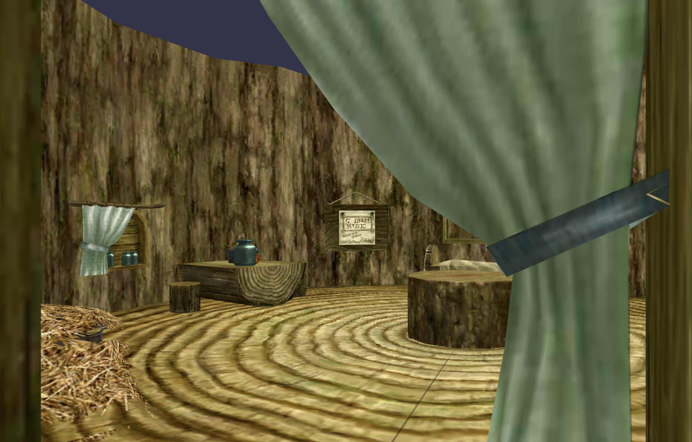

# Textured Mesh Renderer
This program loads triangle mesh data and textures from files, renders them, and allows the user to explore the rendered world by moving the camera around via arrow keys. It is designed to establish comfort with triangular meshes and working with the camera in world space.




## Installation
This program requires a C++ compiler and the OpenGL, GLFW, GLM, and GLEW libraries to be installed. To install OpenGL, GLFW, GLM, and Glew on Ubuntu, you can use the following command:

```
sudo apt install libopengl-dev
sudo apt install libglfw3-dev
sudo apt install libglm-dev
sudo apt-get install libglew-dev
```
## Camera
The program uses a first-person camera controlled by the arrow keys. The camera begins positioned at (0.5, 0.4, 0.5) in world space and facing towards (0, 0, -1). The camera movements are as follows:

  - Up key: move the camera forward in the direction it is currently facing
  - Down key: move the camera backward in the exact opposite direction it is currently facing
  - Left key: rotate the camera counter-clockwise without moving
  - Right key: rotate the camera clockwise without moving
 The camera moves relatively smoothly. An algorithm is implemented to move the camera a certain amount for each frame a key is held down.

## File Reading
The program has a function that reads a file and returns a list of vertices and a list of faces. A VertexData class is implemented, which has instance variables for position (x, y, z), normal vector (nx, ny, nz), color (r, g, b), and texture coordinates (u, v). The class has to be implemented with at least a mandatory variable, i.e., position. A TriData class is also implemented with three instance variables representing the indices of the three vertices making up a triangle.

The readPLYFile function reads a PLY file and returns a list of VertexData objects and a list of TriData objects. The function is designed to handle any number of vertices with properties x, y, z, nx, ny, nz, red, green, blue, u, and v. It also handles faces with a property list vertex_indices. The function returns a tuple of lists in Python and uses the following function prototype to return a reference in C/C++:

```
void readPLYFile (std::string fname, std::vector<VertexData>& vertices, std::vector<TriData>& faces);
```

The program has 10 PLY files to read, each with their bitmap texture.

## Code Structure
The program has a TexturedMesh class that encapsulates a textured triangle mesh. The constructor of the class takes two file paths: one for a PLY file and another for a bitmap image file. The loadARGB_BMP function is used in C/C++ to load the bitmap image, while the Python program uses the PIL library. The readPLYFile function reads the vertices and faces data from the PLY file.

The TexturedMesh class has instance variables for:

  - An integer ID for the VBO to store the vertex positions
  - An integer ID for the VBO to store the texture coordinates
  - An integer ID for the VBO to store the face’s vertex indices
  - An integer ID for the Texture Object created to store the bitmap image.
  - An integer ID for the VAO used to render the texture mesh
  - An integer ID for the shader program created and linked to render the particular textured mesh
  - The class also has a draw(glm::mat4 MVP) instance method that is called by the main function to render that TexturedMesh object.

In the main method, all the TexturedMesh objects are created, and a projection matrix is set up with a vertical field of view of 45°. In the render loop, user input is handled to move the camera around, and the TextureMesh.draw function is called to render the textured mesh.
